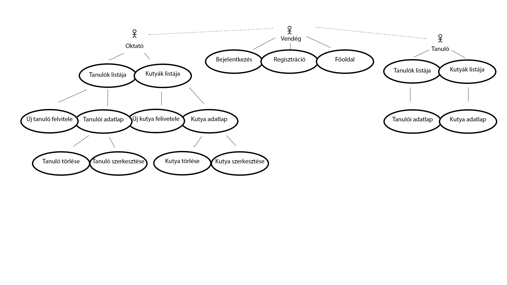
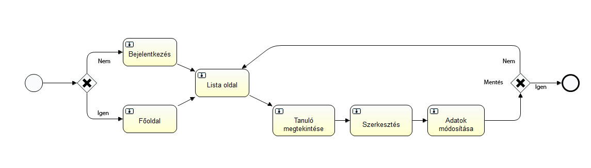
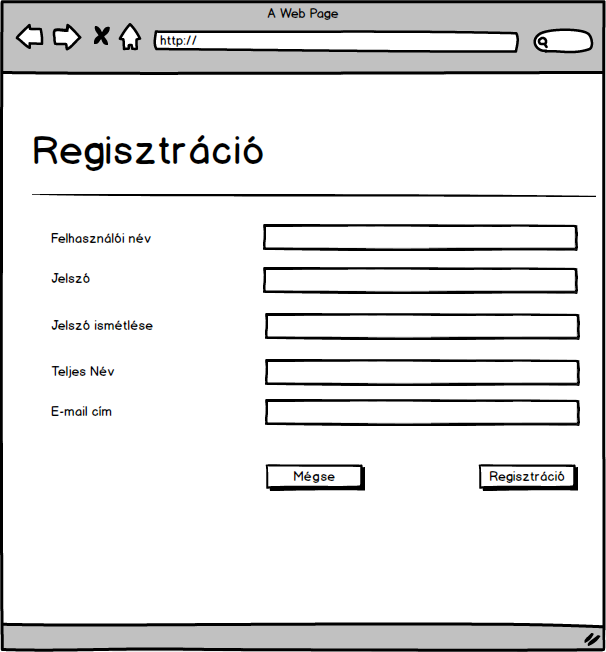
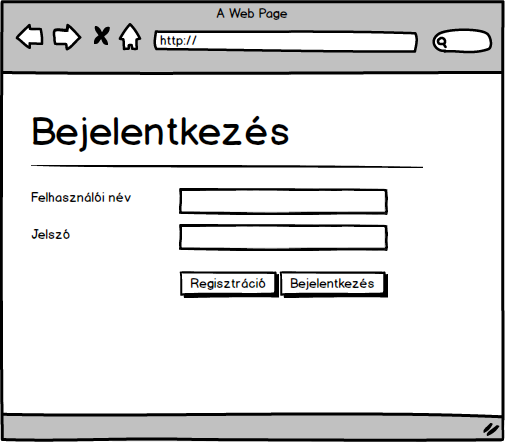
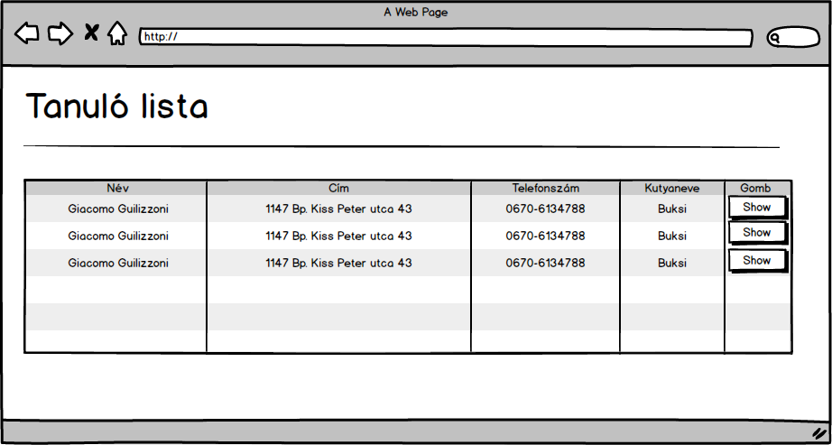
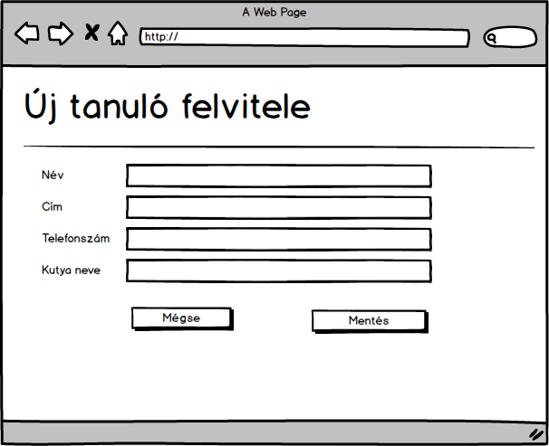
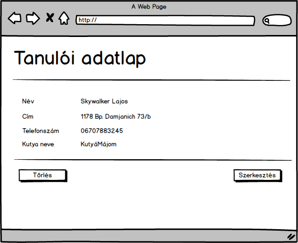
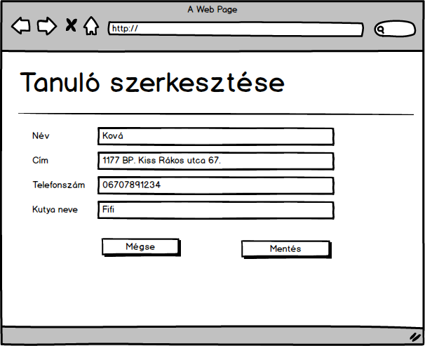

Dokumentáció
Tanulók
Készítette: Szántó Attila
1. Követelményanalízis
1.1. Célkitűzés, projektindító dokumentum
A program legfőbb célja, hogy jól átláthatóan, és egyértelműen nyomon követhető legyen a kutyaiskola tanulói, és kutyáik egy webes vastagkliens, azaz egyoldali alkalmazás felhasználásával. Az adatok védelme érdekében legyen lehetőség regisztrációra, majd bejelentkezésre. Két felhasználó típus létezik, tanuló és oktató. Ezek közül, csak tanuló típusú felhasználó regisztrálható.
Funkcionális követelmények:
•	Regisztráció
•	Bejelentkezés
•	Minden bejelentkezett felhasználó által elérhető funkciók
o	rögzített adatok megtekintése
•	Csak bejelentkezett „oktató” típusú felhasználók által elérhető funkciók
o	új tanuló felvitele
o	új kutya felvitele
o	meglévő tanuló szerkesztése
o	meglévő kutya szerkesztése
o	meglévő tanuló törlése
o	meglévő kutya törlése
Nem funkcionális követelmények:
•	Könnyű áttekinthetőség: Színekkel típus szerint csoportosítás
•	Használhatóság: Könnyű áttekinthetőség, ésszerű elrendezés, könnyen kezelhetőség
•	Megbízhatóság: jelszóval védett funkciók, és a jelszavak védelme a háttérben. Hibásan bevitt adatok esetén a program jól láthatóan jelezzen a felhasználónak, és emelje ki a hibás beviteli mezőket. A jól bevitt adatok maradjanak az űrlapban.
•	Karbantarthatóság: könnyen lehessen bővíteni, a különböző típusú fájlok külön csoportosítva, ésszerűen legyenek felbontva, a könnyebb fejleszthetőség miatt
1.2. Szakterületi fogalomjegyzék
•	Oktató: A kutya képzéséért és az adatok karbantartásáért felel 
•	Tanuló: Az oktatásra járó kutya gazdája
•	Kutya: Az oktatásra járó kutya
1.3. Használatieset-modell, funkcionális követelmények
Vendég: Csak a publikus oldalakat éri el
•	Főoldal
•	Bejelentkezés
•	Regisztráció
Bejelentkezett felhasználó (tanuló): A publikus oldalak elérésén felül egyéb funkciókhoz is hozzáfér.
•	Tanulók listája
•	Kutyák listája
•	Tanulói adatlap
•	Kutya adatlap
Bejelentkezett felhasználó (oktató): A publikus oldalak és a „tanuló” típusú felhasználó elérésén felül egyéb funkciókhoz is hozzáfér.
•	Új tanuló felvitele
•	Új kutya felvitele
•	Meglévő tanuló szerkesztése
•	Meglévő kutya szerkesztése
•	Meglévő tanuló törlése
•	Meglévő kutya törlése

 
Vegyünk példának egy egyszerű folyamatot:
Meglévő tanuló szerkesztése:
1.	A felhasználó az oldalra érkezve, bejelentkezik egy oktató jogkörrel rendelkező felhasználóval
2.	Regisztráció után megtekintheti a tanulókat listázó oldalt, ahol kiválaszthatja a szerkeszteni kívánt tanulót.
3.	Megnyomja a „Megtekintés” feliratú gombot
4.	A megtekintés oldalon kiválaszthatja a „Szerkesztés” gombot
5.	Szerkesztés oldalon felviszi az új adatokat
6.	Submit gombra kattintva elmenti a változásokat

 
2. Tervezés
2.1. Architektúra terv
2.1.1. Komponensdiagram
    
 
2.1.2. Oldaltérkép:
Publikus:
•	Főoldal
•	Bejelentkezés
•	Regisztráció
Bejelentkezett (tanuló):
•	Főoldal
•	Tanuló listaoldal
o	Tanuló adatlap
•	Kutya listaoldal
o	Kutya adatlap
 
Bejelentkezett (oktató):
•	Főoldal
•	Tanuló listaoldal
o	Új 
o	Adatlap
	Törlés
	Szerkesztés
•	Kutya listaoldal
o	Új 
o	Adatlap
	Törlés
	Szerkesztés
2.1.3. Végpontok
•	GET/: főoldal
•	GET/login: bejelentkező oldal
•	POST/login: bejelentkező adatok felküldése
•	GET/login/signup: regisztrációs oldal
•	POST/login/signup: regisztrációs adatok felküldése
•	GET/logout: kijelentkező oldal
•	GET/student/list: tanulólista oldal
•	GET/student/new: új tanuló felvétele
•	POST/student/new: új tanuló felvételéhez szükséges adatok felküldése
•	GET/student/id: tanuló adatok
•	GET/student/delete=id: tanuló törlése
•	GET/student/edit=id: tanuló módosítása
•	POST/student/edit=id: tanuló módosítása, adatok felküldése
•	GET/dog/list: kutyalista oldal
•	GET/dog/new: új kutya felvétele
•	POST/dog/new: új kutya felvételéhez szükséges adatok felküldése
•	GET/dog/id: kutya adatok
•	GET/dog/delete=id: kutya törlése
•	GET/dog/edit=id: kutya módosítása
•	POST/dog/edit=id: kutya módosítása, adatok felküldése

2.2. Felhasználói-felület modell
2.2.1.Oldalvázlatok:
Főoldal 
 

Regisztrációs oldal 
 
 
Bejelentkező  oldal
 

Példa listázó

Új tanuló felvétele 

Tanuló megtekintése 

Tanuló szerkesztése     

 
2.2.3. Dinamikus működés
Szekvenciadiagram

Vegyünk példának a regisztrációt, majd egy új elem felvételét, szerkesztését, törlését, mindezt szekvenciadiagrammon.
 
3. Implementáció
3.1.1. Fejlesztőkörnyezet
IDE: VS Code
•	Github account szükséges
•	Belépés után új workspace létrehozása (node.js)
•	Ezután elkezdhetjük a kód írását
•	git add paranccsal kiválaszthatunk egy fájlt verzionálásra, vagy git add . paranccsal az összes fájlt kiválaszthatjuk
•	git commit -m "commit" paranccsal feltehetjük a fájlokat a cloud9 helyi tárolójába. Az így megjelölt verziókhoz a későbbiekben visszatérhetünk, különbségüket megtekinthetjük.
•	git push origin master paranccsal a lokális tárolóból feltölthetjük a tartalmat a Github-ra.
•	Végezetül a Github oldalán leellenőrizhetjük a munkánkat.

6. Irodalomjegyzék:
http://webprogramozas.inf.elte.hu/alkfejl.php
http://ade.web.elte.hu/wabp/lecke2_lap1.html
http://webprogramozas.inf.elte.hu/alkfejl/A_dokumentacio_felepitese.pdf
\ No newline at end of file